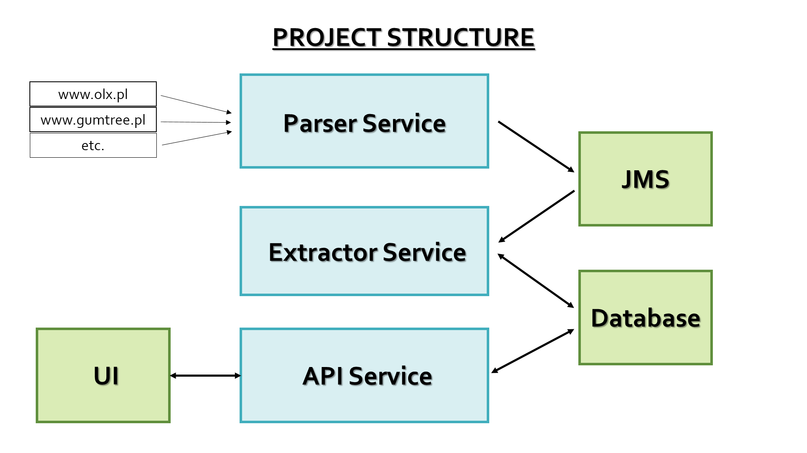

# AnnouncementProcessor

## Problem description
This project is focused on flat rent announcements. Searching for an aparment is a hard task. The person who searches real estate offers faces many difficulties. These range from offers being announced on different portals, through insufficient information contained in the searchable data, to poorly grouped locations.

## Application description
The application tries to handle all of issues mentioned above. 
It is builded on microservices as showed in image below.

**Parser service** - Responsible for parsing announcements from different websites to the same format. Next task for this service is to push announcements in new format via JMS.

**Extractor service** - Responsible for extracting data from description like LOCATION and FULL COST OF RENT

**API service** - Responsible for export data with REST API

## Installation
TODO
